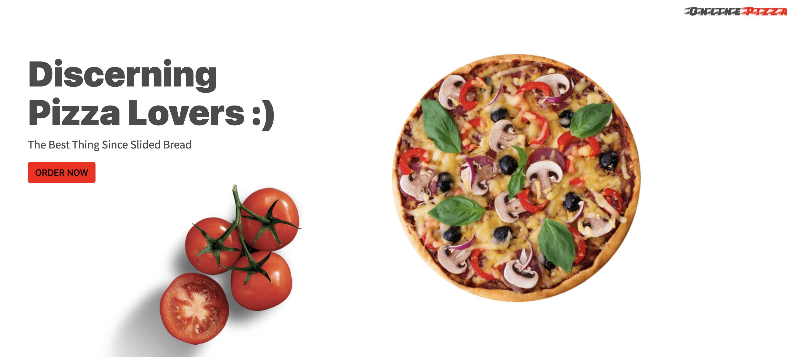

# OnlinePizzaa Store 

## Target Group:
Discerning Pizza Lovers

## Goal:

Create a unique, elegant, easy-to-use experience.

### Needs:
An online experience to enhance the home (or office) PIZZA experience

## **Value:

It is easy, convenient, and special to shop with advanced information and samples for those with discerning tastes. Samples will fit the buying pattern and preferences of the customer.

The application must have a unique feature where users can play with the price and location range using a two-sided slider making it extremely convenient.

## **Key Features:

 Learn about pizzas and regions, and shop, buy, and get social about pizza.

This course will look at examples related to the payments and checkout features of the online shopping experience.

Keeping in mind the domain & target market, the application is exposed to a neat design full of smooth and casual animations.

# Author
Cohort Test
## Contact Me Via

# Setup Requirements
* Git
* Web-browser of choice
* Github
## Setup Installation
* Copy the github repository url
* Clone to your computer
* Double click the index.html to open with live server

# Technologies Used
 * HTML
 * CSS
 * JavaScript
 * Bootstrap
 * jQuery

# Licence
This project is licensed under the terms of the MIT license.
<a>MIT</a>

